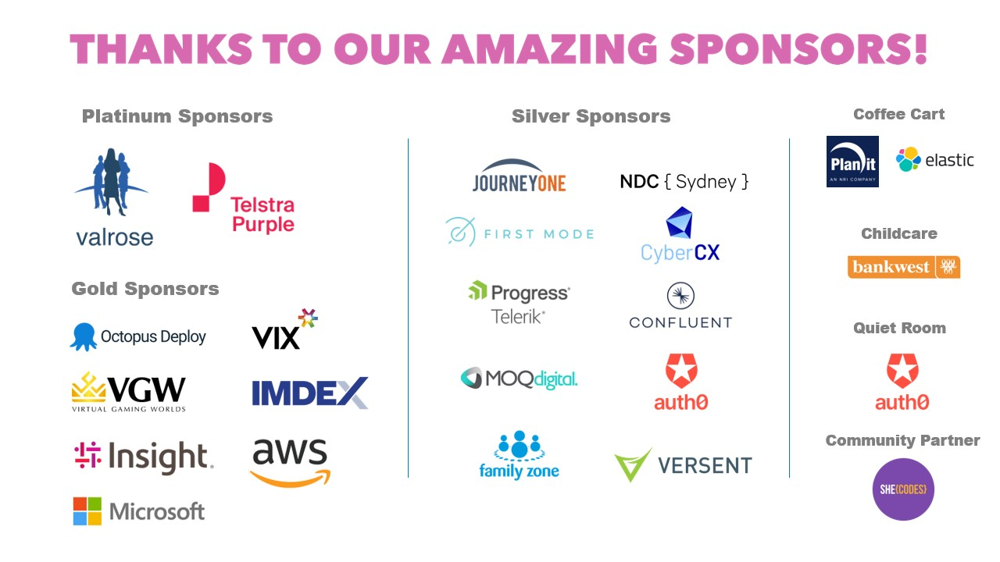
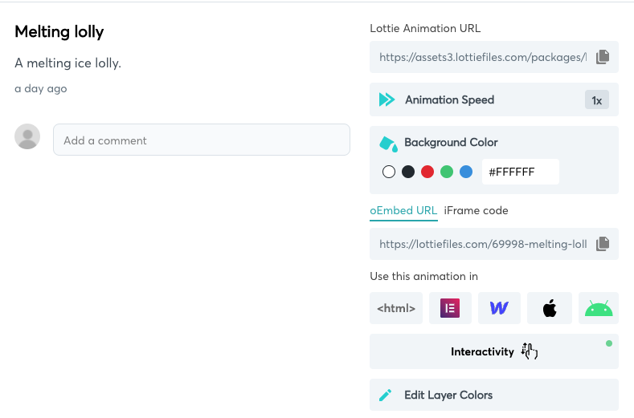
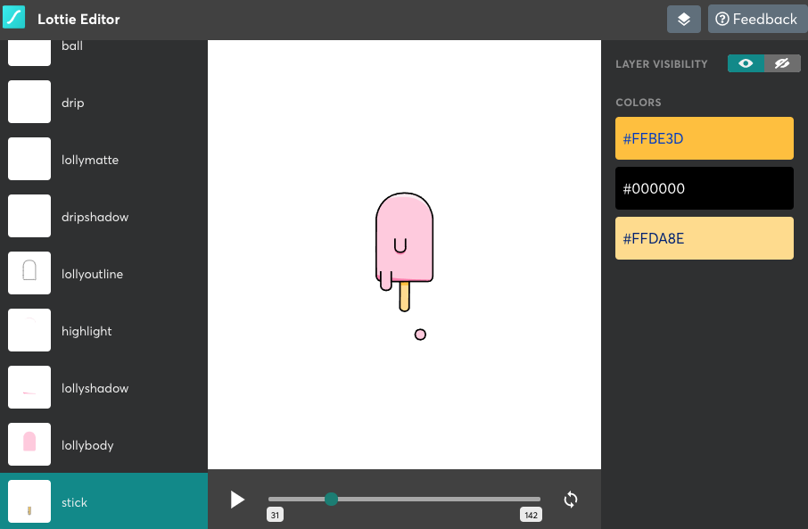
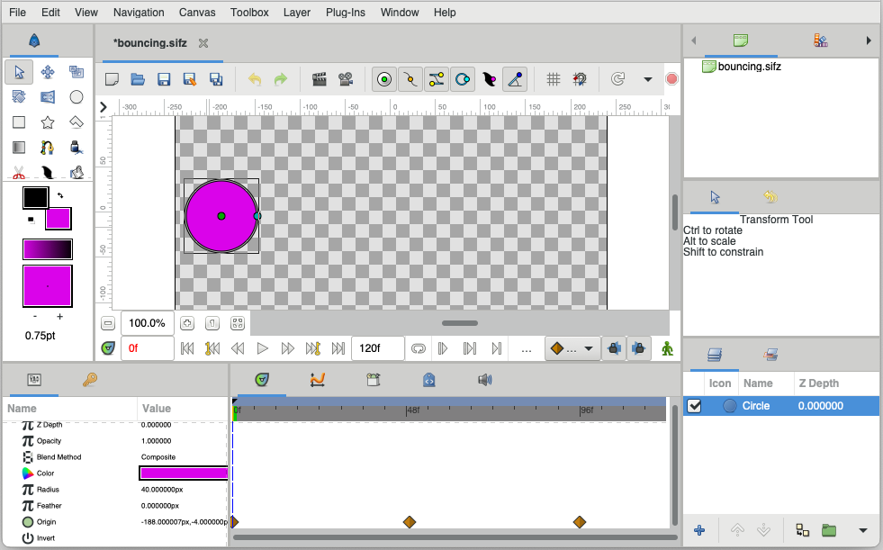
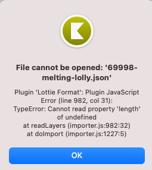
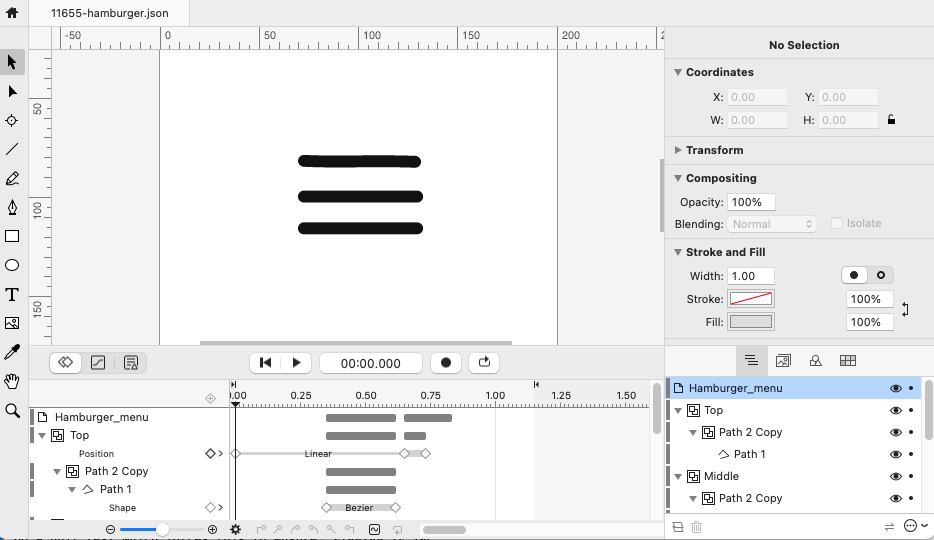
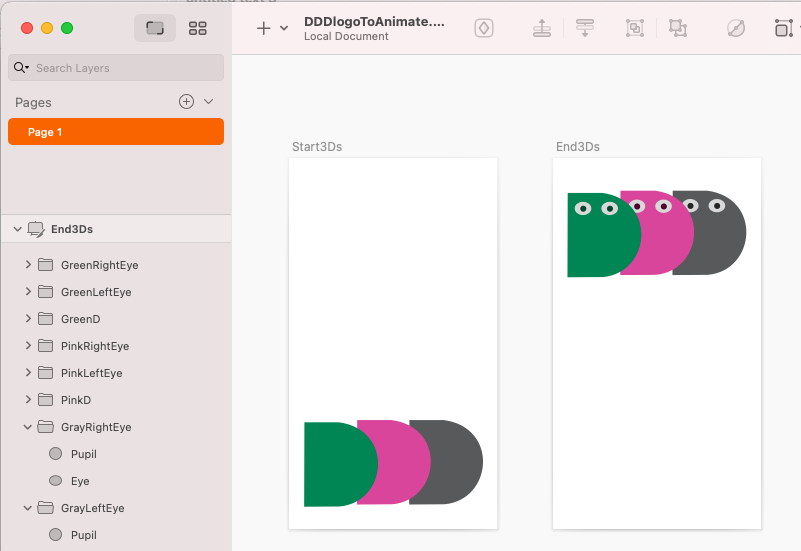
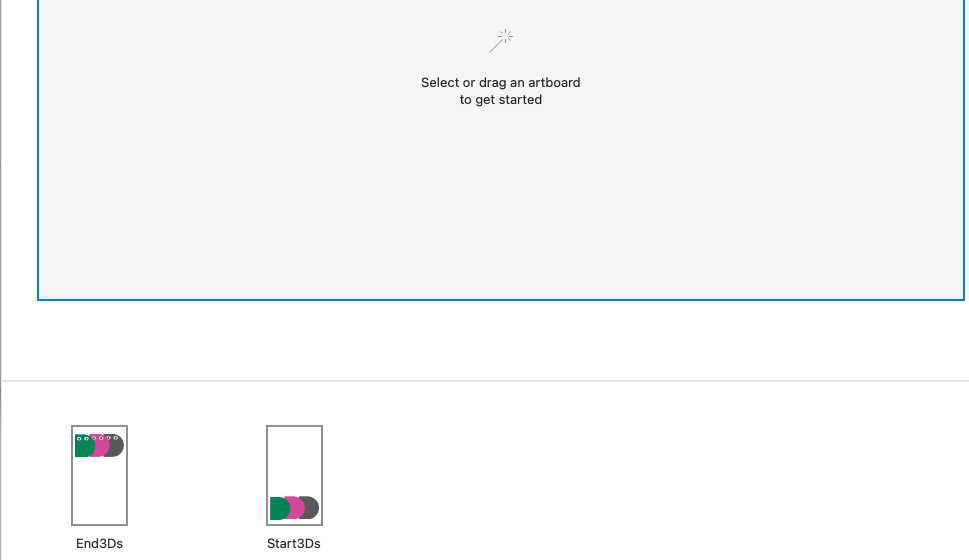
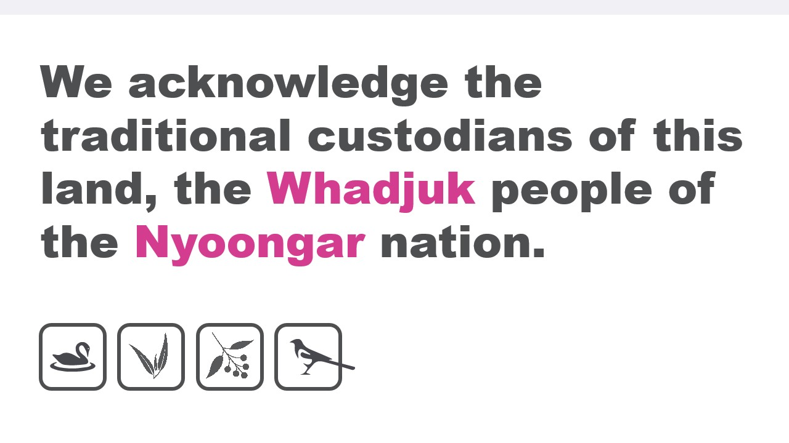

```{=html}
<!-- usual source https://unpkg.com/@lottiefiles/lottie-player@latest/dist/lottie-player.js -->
```
```{=html}
<script src="./assets/lottie-player.js"></script>
```
<!-- section 0 -->

# Sponsors



<!-- section 1 -->

# Animation {#animation bg="#eee"}

```{=html}
<h3>
```
A Whole Lottie Tools out There
```{=html}
</h3>
```
```{=html}
<h4>
```
Andy Dent
```{=html}
</h4>
```


<!-- section 2 -->

# Why Animate? - Lottie reasons

**Amuse**

Distract

Inform

`<lottie-player 
    src="./assets/8103-jump.json"  background="transparent"  speed="1"  style="width: 300px; height: 300px;"  loop autoplay >`{=html}
`</lottie-player>`{=html}

```{=html}
<aside class="notes">
```
Just for fun, as a little bit of whimsy in your UI
```{=html}
</aside>
```
<!-- section 3 -->

# Why Animate? - Lottie reasons

Amuse

**Distract**

Inform

`<lottie-player 
    src="./assets/961-checked-loading.json"  background="transparent"  speed="1"  style="width: 300px; height: 300px;"  loop autoplay >`{=html}
`</lottie-player>`{=html}

```{=html}
<aside class="notes">
```
Typically for loading screens, or maybe as
```{=html}
</aside>
```
<!-- section 4 -->

# Why Animate? - Lottie reasons

Amuse

Distract

**Inform**

`<lottie-player 
    src="./assets/926-menu-volver.json"  background="transparent"  speed="1"  style="width: 300px; height: 300px;"  loop autoplay >`{=html}
`</lottie-player>`{=html}

```{=html}
<aside class="notes">
```
As a fun onboarding
```{=html}
</aside>
```
<!-- section 5 -->

# Lottie

Simple animated vectors from Adobe After Effects via *bodymovin* plugin to JSON, effectively a [standard](http://airbnb.io/lottie/#/supported-features) invented in [2015](https://lottiefiles.com/what-is-lottie) with web player.

Fast native players by [AirBnb](http://airbnb.io/lottie/#/) 2017 onwards

Visual editors we will be talking about:`<br/>`{=html}[Keyshape](https://www.keyshapeapp.com/), [Flow](https://createwithflow.com/) and [Synfig](https://www.synfig.org/).

```{=html}
<aside class="notes">
```
see [Origin story](https://airbnb.design/introducing-lottie/)
```{=html}
</aside>
```
<!-- section 6 -->

# Why does Text Matter?

::: {.left style="float:left;width:20%"}
`<lottie-player 
    src="./assets/11655-hamburger.json"  background="transparent"  speed="1"  style="width: 300px; height: 300px;"  loop autoplay >`{=html}
`</lottie-player>`{=html}
:::

::: {.right style="float:right:width:78%"}
Lottie is text just like SVG`<br/>`{=html}(except JSON rather than \<XML\>)

Easily parsed, hand-edited, `<br />`{=html}& diffed by version control.
:::

::: {style="float:none"}
``` {.javascript}
{"v":"5.5.8","fr":60,"ip":0,"op":69,"w":200,"h":200,"nm":"
Hamburger_menu","ddd":0,"assets":[],"layers":[{"ddd":0,"ind"
:1,"ty":4,"nm":"Top","sr":1,"ks":{"o":{"a":0,"k":100,"ix":11
},"r":{"a":0,"k":0,"ix":10},"p":{"a":1,"k":[{"i":{"x":0.58,"
y":0.58},"o":{"x":0.42,"y":0.42},"t":0,"s":[101,81.5,0],"to"
:[0,0,0],"ti":[0,0,0]},{"i":{"x":0.58,"y":1},"o":{"x":0.42,"
y":0},"t":39,"s":[101,81.5,0],"to":[0,0.583,0],"ti":[0,-0.
583,0]},{"t":44,"s":[101,85,0]}],"ix":2},"a":{"a":0,"k":[0,0
,0],"ix":1},"s":{"a":0,"k":[100,100,100],"ix":6}},"ao":0,"
shapes":[{"ty":"gr","it":[{"ind":0,"ty":"sh","ix":1,"ks":{"a
":1,"k":[{"i":{"x":0.58,"y":1},"o":{"x":0.001,"y":0},"t":21,
"s":[{"i":[[0,0],[-5.832,0.104],[0,0]],"o":[[0,0],[5.167,-0.
092],[0,0]],"v":[[-9.5,0],[-0.167,0.092],[9.167,0.167]],"c":
false}]},{"t":37,"s":[{"i":[[0,0],[-10.333,-0.092],[0,0]],"o
":[[0,0],[9.667,0.086],[0,0]],"v":[[-9.833,0.167],[-0.334,-6
.241],[8.833,0.333]],"c":false}]}],"ix":2},"nm":"Path
1","mn":"ADBE Vector Shape -
Group","hd":false},{"ty":"st","c":{"a":0,"k":[0.070588000119
,0.070588000119,0.062744997442,1],"ix":3},"o":{"a":0,"k":100
,"ix":4},"w":{"a":0,"k":2,"ix":5},"lc":2,"lj":1,"ml":4,"bm":
0,"nm":"Stroke 1","mn":"ADBE Vector Graphic -
Stroke","hd":false},{"ty":"tr","p":{"a":0,"k":[0,0],"ix":2},
"a":{"a":0,"k":[0,0],"ix":1},"s":{"a":0,"k":[300,300],"ix":3
},"r":{"a":0,"k":0,"ix":6},"o":{"a":0,"k":100,"ix":7},"sk":{
"a":0,"k":0,"ix":4},"sa":{"a":0,"k":0,"ix":5},"nm":"
Transform"}],"nm":"Path 2
Copy","np":3,"cix":2,"bm":0,"ix":1,"mn":"ADBE Vector
Group","hd":false}],"ip":0,"op":197,"st":0,"bm":0},{"ddd":0,
"ind":2,"ty":4,"nm":"Middle","sr":1,"ks":{"o":{"a":0,"k":100
,"ix":11},"r":{"a":0,"k":0,"ix":10},"p":{"a":1,"k":[{"i":{"x
":0.58,"y":1},"o":{"x":0.42,"y":0},"t":39,"s":[101,99.5,0],"
to":[0,0.333,0],"ti":[0,-0.333,0]},{"t":44,"s":[101,101.5,0]
}],"ix":2},"a":{"a":0,"k":[0,0,0],"ix":1},"s":{"a":0,"k":[
100,100,100],"ix":6}},"ao":0,"shapes":[{"ty":"gr","it":[{"
ind":0,"ty":"sh","ix":1,"ks":{"a":0,"k":{"i":[[0,0],[0,0]],"
o":[[0,0],[0,0]],"v":[[-9.5,0],[9.5,0]],"c":false},"ix":2},"
nm":"Path 1","mn":"ADBE Vector Shape -
Group","hd":false},{"ty":"st","c":{"a":0,"k":[0.070588000119
,0.070588000119,0.062744997442,1],"ix":3},"o":{"a":0,"k":100
,"ix":4},"w":{"a":0,"k":2,"ix":5},"lc":2,"lj":1,"ml":4,"bm":
0,"nm":"Stroke 1","mn":"ADBE Vector Graphic -
Stroke","hd":false},{"ty":"fl","c":{"a":0,"k":[0.
070588000119,0.070588000119,0.062744997442,1],"ix":4},"o":{"
a":0,"k":100,"ix":5},"r":1,"bm":0,"nm":"Fill 1","mn":"ADBE
Vector Graphic -
Fill","hd":false},{"ty":"tr","p":{"a":0,"k":[0,0],"ix":2},"a
":{"a":0,"k":[0,0],"ix":1},"s":{"a":0,"k":[300,300],"ix":3},
"r":{"a":0,"k":0,"ix":6},"o":{"a":0,"k":100,"ix":7},"sk":{"a
":0,"k":0,"ix":4},"sa":{"a":0,"k":0,"ix":5},"nm":"Transform"
}],"nm":"Path 2
Copy","np":3,"cix":2,"bm":0,"ix":1,"mn":"ADBE Vector
Group","hd":false}],"ip":0,"op":197,"st":0,"bm":0},{"ddd":0,
"ind":3,"ty":4,"nm":"Bottom","sr":1,"ks":{"o":{"a":0,"k":100
,"ix":11},"r":{"a":0,"k":0,"ix":10},"p":{"a":0,"k":[101,115.
5,0],"ix":2},"a":{"a":0,"k":[0,0,0],"ix":1},"s":{"a":0,"k":[
100,100,100],"ix":6}},"ao":0,"shapes":[{"ty":"gr","it":[{"
ind":0,"ty":"sh","ix":1,"ks":{"a":0,"k":{"i":[[0,0],[0,0]],"
o":[[0,0],[0,0]],"v":[[-9.5,0],[9.5,0]],"c":false},"ix":2},"
nm":"Path 1","mn":"ADBE Vector Shape -
Group","hd":false},{"ty":"st","c":{"a":0,"k":[0.070588000119
,0.070588000119,0.062744997442,1],"ix":3},"o":{"a":0,"k":100
,"ix":4},"w":{"a":0,"k":2,"ix":5},"lc":2,"lj":1,"ml":4,"bm":
0,"nm":"Stroke 1","mn":"ADBE Vector Graphic -
Stroke","hd":false},{"ty":"fl","c":{"a":0,"k":[0.
070588000119,0.070588000119,0.062744997442,1],"ix":4},"o":{"
a":0,"k":100,"ix":5},"r":1,"bm":0,"nm":"Fill 1","mn":"ADBE
Vector Graphic -
Fill","hd":false},{"ty":"tr","p":{"a":0,"k":[0,0],"ix":2},"a
":{"a":0,"k":[0,0],"ix":1},"s":{"a":0,"k":[300,300],"ix":3},
"r":{"a":0,"k":0,"ix":6},"o":{"a":0,"k":100,"ix":7},"sk":{"a
":0,"k":0,"ix":4},"sa":{"a":0,"k":0,"ix":5},"nm":"Transform"
}],"nm":"Path 2 Copy
2","np":3,"cix":2,"bm":0,"ix":1,"mn":"ADBE Vector
Group","hd":false}],"ip":-55,"op":142,"st":-55,"bm":0},{"ddd
":0,"ind":4,"ty":4,"nm":"Ketchup","sr":1,"ks":{"o":{"a":0,"k
":100,"ix":11},"r":{"a":0,"k":0,"ix":10},"p":{"a":1,"k":[{"i
":{"x":0.833,"y":1},"o":{"x":0.42,"y":0},"t":44,"s":[114.875
,97.875,0],"to":[0.021,1.396,0],"ti":[-0.021,-1.396,0]},{"t"
:50,"s":[115,106.25,0]}],"ix":2},"a":{"a":0,"k":[0,0,0],"ix"
:1},"s":{"a":1,"k":[{"i":{"x":[0.667,0.667,0.667],"y":[1,1,1
]},"o":{"x":[0.333,0.333,0.333],"y":[0,0,0]},"t":44,"s":[100
,0,100]},{"t":50,"s":[100,100,100]}],"ix":6}},"ao":0,"shapes
":[{"ty":"gr","it":[{"ind":0,"ty":"sh","ix":1,"ks":{"a":0,"k
":{"i":[[0,0],[0,0],[0,0]],"o":[[0,0],[0,0],[0,0]],"v":[[-2.
5,-1.5],[2.5,-1.5],[0.01,1.5]],"c":true},"ix":2},"nm":"Path
1","mn":"ADBE Vector Shape -
Group","hd":false},{"ty":"fl","c":{"a":0,"k":[0.070588000119
,0.070588000119,0.070588000119,1],"ix":4},"o":{"a":0,"k":100
,"ix":5},"r":1,"bm":0,"nm":"Fill 1","mn":"ADBE Vector
Graphic -
Fill","hd":false},{"ty":"tr","p":{"a":0,"k":[0,0],"ix":2},"a
":{"a":0,"k":[0,0],"ix":1},"s":{"a":0,"k":[300,300],"ix":3},
"r":{"a":0,"k":0,"ix":6},"o":{"a":0,"k":100,"ix":7},"sk":{"a
":0,"k":0,"ix":4},"sa":{"a":0,"k":0,"ix":5},"nm":"Transform"
}],"nm":"Path 3","np":2,"cix":2,"bm":0,"ix":1,"mn":"ADBE
Vector
Group","hd":false}],"ip":0,"op":197,"st":0,"bm":0}],"markers
":[]}
```
:::

```{=html}
<aside class="notes">
```
Funny story about SVGator and attacking lottie because noisy format.
```{=html}
</aside>
```
<!-- section 7 -->

# LottieFiles

The [LottieFiles](https://lottiefiles.com/) site is a (now) commercial marketplace. Apart from providing hosting and sales of many lottie animations, it allows for some simple recolouring.

Let's play with the [Melting Lolly](https://lottiefiles.com/69998-melting-lolly).
`<lottie-player 
    src="./assets/69998-melting-lolly.json"  background="transparent"  speed="1"  style="width: 300px; height: 300px;"  loop autoplay >`{=html}
`</lottie-player>`{=html}

<!-- section 8 -->

# LottieFiles Demo 1

Layer recolouring is a visual tool.


<!-- section 9 -->

# LottieFiles Demo 2

Even a simple animation has a ton of small components


<!-- section 10 -->

# Graphical Editors

  Synfig                 Keyshape                   Flow                Cavalry
  ------------ ---------------------------- -------------------- ---------------------
  M/W/L                    Mac                      Mac                 Mac/Win
  Free GPL      \$47`<br/>`{=html}once-off      Lottie \$270          \$30/ month
  Import SVG     Import SVG or Lottie(\*)    Sketch, SVG, Figma   SVG + Paste vectors
                                             +Native Mobile UI        +Procedural

Adobe After Effects [\$30/month](https://www.adobe.com/au/creativecloud/plans.html?filter=video-audio&plan=individual)

```{=html}
<aside class="notes">
```
Keyshape has free 14 day trial including Lottie export as its via plugins.
Keyshape is basically extended SVG

Flow Lottie export in middle tier \$270 AUD, prices range \$135 .. \$450 for full native code export
```{=html}
</aside>
```
<!-- section 11 -->

# Cavalry

*[Cavalry](https://cavalry.scenegroup.co/) is a brand new procedural application with ambitions to make waves in the worlds of animation, design, creative coding, film, generative art, data visualisation, experiential and advertising.*

Incredibly powerful cross-platform product, worth a serious look but not demo'ing today due lack of time. See [video of Lottie export](https://www.youtube.com/watch?v=NH3x1wtKusU)

```{=html}
<aside class="notes">
```
Cavalry only popped onto my radar recently, initially had dismissed as being focused on procedural animation. I just didn't have the time to learn another, very powerful tool & not inclined to sign up to pay a subscription to test the Lottie export.
```{=html}
</aside>
```
<!-- section 12 -->

# Cavalry Export screenshot


<!-- section 13 -->

# Synfig Demo



<!-- section 14 -->

# Keyshape

Keyshape has an extensible plugin architecture which includes [one they created for Lottie import/export.](https://github.com/Pixofield/keyshape-lottie-format)`<br/>`{=html}
(and another for Android's *Animated Vector Drawables* which we will ignore)



<!-- section 15 -->

# Keyshape Demo 1



<!-- section 16 -->

# Keyshape Demo 2


```{=html}
<aside class="notes">
```
I've selected the Ketchup item path inside the object to be able to change the color
```{=html}
</aside>
```
<!-- section 17 -->

# Keyshape Demo 3


```{=html}
<aside class="notes">
```
With the bun selected in the timeline, change the easing curve to make its shape change popup more abruptly.
```{=html}
</aside>
```
<!-- section 18 -->

# Flow

::: {.left style="float:left;width:20%"}
`<lottie-player 
    src="./assets/flowDDD.min.json"  background="transparent"  speed="1"  style="width: 300px; height: 300px;"  loop autoplay >`{=html}
`</lottie-player>`{=html}
:::

::: {.right style="float:right:width:70%"}
Flow is focused on **UX** animation.

Lottie export inc native code for iOS or Android, `<br/>`{=html}HTML includes minified.

For control animations, `<br/>`{=html}also get native code, bytes vs kB.
:::

<!-- section 19 -->

# Flow Demo 1 - Start in Sketch



<!-- section 20 -->

# Flow Demo 2


<!-- section 21 -->

# Flow Demo 3



<!-- section 22 -->

# Flow Demo 4


<!-- section 23 -->

# Further Details

[**github.com/AndyDentFree/DDDLottie21**](https://github.com/AndyDentFree/DDDLottie21) `<br/>`{=html}
for this presentation and all samples shown`<br/>`{=html}
Twitter: @andydentperth

